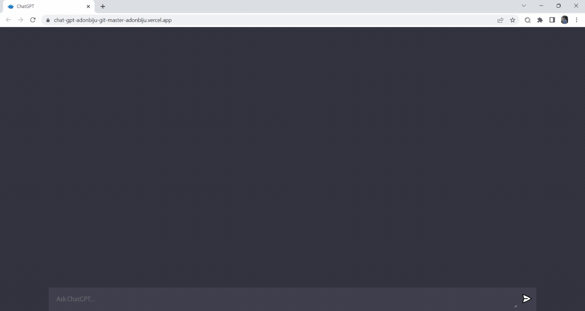

# ChatGPT
  
  
# Technologies used :
    * OpenAI
    * Vite
    * Vanilla JS
    * Node.js
    * Express.js
# To Running the frontend and backend

Clone the project

```bash
  git clone https://github.com/adonbiju/chatGPT.git
```
# To Run the server
Go to the project directory

```bash
  cd chatgpt_server_nodejs
```

Install dependencies

```bash
  npm install
```

Create a **.env** file inside project directory with fields given below.

```bash
  #OpenAI API key
  OPENAI_API_KEY=
```

Start the server

```bash
  npm  run server
```
# To Run the client
Go to the project directory

```bash
  cd chatgpt_client_vite_vanila
```

Install dependencies

```bash
  npm install
```
Start the server

```bash
  npm  run dev
```
## Live
  https://chat-gpt-adonbiju.vercel.app/

## Demo Video
  <h1 align="center">
  
</h1>